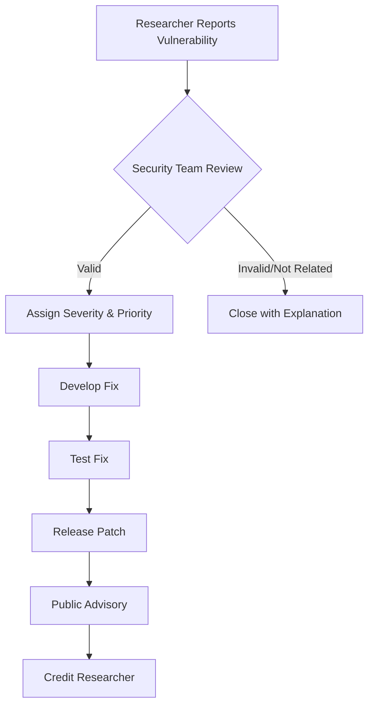

# Security Policy

## Supported Versions

| Version | Supported          |
| ------- | ------------------ |
| 2.0.x   | :white_check_mark: |
| 1.0.x   | :x:                |

We recommend always using the latest version of Kalitelligence for the most up-to-date security features and bug fixes.

## Reporting a Vulnerability

We take the security of Kalitelligence seriously. If you believe you have found a security vulnerability, please report it to us as described below.

### **Please do NOT report security vulnerabilities through public GitHub issues.**

### How to Report

**Preferred Method:** Send an email to [security@kalitelligence.dev](mailto:security@kalitelligence.dev) (if configured) or use GitHub's private vulnerability reporting feature.

**Alternative:** Create a draft security advisory in the repository's Security tab.

### What to Include

Please include the following information in your report:

1. **Description**: A clear description of the vulnerability
2. **Affected Version**: Which version(s) are affected
3. **Impact**: The potential impact of the vulnerability
4. **Reproduction Steps**: Detailed steps to reproduce the issue
5. **Proof of Concept**: Code or commands that demonstrate the vulnerability (if applicable)
6. **Suggested Fix**: If you have suggestions for how to fix the issue
7. **Your Contact**: How we can reach you for follow-up questions

### What to Expect

- **Acknowledgment**: We will acknowledge receipt of your vulnerability report within **48 hours**
- **Initial Assessment**: We will provide an initial assessment within **5 business days**
- **Regular Updates**: We will keep you informed of our progress every **2 weeks**
- **Resolution Timeline**: We aim to resolve critical vulnerabilities within **30 days**
- **Public Disclosure**: We request that you refrain from public disclosure until we have issued a patch

### Process

## Security Best Practices for Users

### Before Installation

1. **Verify Source**: Only download Kalitelligence from the official GitHub repository
2. **Check Integrity**: Verify GPG signatures or SHA256 hashes when available
3. **Review Code**: Examine the script before running it with elevated privileges
4. **Test Environment**: Always test in a VM or isolated environment first

### During Installation

1. **Run as Root Only When Necessary**: The script requires root for installation but creates user-owned files
2. **Review Options**: Carefully review installation options, especially `--with-offsec`
3. **Network Security**: Consider using `--no-ufw` only if you have alternative firewall rules
4. **Monitor Logs**: Watch installation logs for unexpected behavior

### After Installation

1. **Update Regularly**: Run `sudo ti-update` regularly to get security patches
2. **Review Permissions**: Check file permissions on installed tools and data
3. **Secure Credentials**: Protect any API keys or webhook URLs you configure
4. **Monitor Activity**: Regularly review logs in `/var/log/ti-suite/`
5. **Backup Data**: Implement your own backup strategy for case data and findings

### Tool-Specific Security

#### Offensive Tools
- Only use offensive tools (`hashcat`, `hydra`, `john`, etc.) on systems you own or have explicit permission to test
- These tools are installed only when explicitly requested with `--with-offsec`

#### Dark Web Tools
- Tor and related tools provide anonymity but not complete security
- Never mix personal browsing with investigation activities
- Use dedicated VMs for dark web investigations

#### OSINT Tools
- Respect terms of service of target websites
- Implement rate limiting to avoid IP bans
- Be aware of legal implications in your jurisdiction

## Known Security Limitations

### Current Version (2.0)

1. **Single-User Design**: No multi-user isolation or permissions
2. **Local Storage Only**: No encryption for stored data
3. **Plaintext Configurations**: API keys and webhooks stored in plaintext
4. **No Audit Logging**: Limited tracking of user actions
5. **Root Required**: Installation requires root privileges

### Mitigations

- Store sensitive data in encrypted volumes
- Use separate user accounts for different investigations
- Implement network-level logging and monitoring
- Regular security audits of installed tools

## Security Features

### Implemented

✅ Input sanitization for user-provided domains and targets  
✅ Secure temporary file creation  
✅ Signature verification for critical downloads (planned)  
✅ Firewall configuration (UFW)  
✅ Isolated Python virtual environments  
✅ Log rotation and secure log storage  

### Planned

⏳ GPG signature verification for all downloads  
⏳ Encrypted configuration storage  
⏳ Role-based access control  
⏳ Comprehensive audit logging  
⏳ Automated security scanning of installed tools  
⏳ Container isolation for risky operations  

## Vulnerability Disclosure Policy

We follow a coordinated disclosure process:

1. **Receive Report**: Security team receives and acknowledges the report
2. **Validate**: Confirm the vulnerability and assess impact
3. **Develop Fix**: Create and test a patch
4. **Release**: Publish updated version with security advisory
5. **Credit**: Acknowledge the researcher (unless they prefer anonymity)

We appreciate responsible disclosure and will credit researchers who report valid security issues (unless they prefer to remain anonymous).

## Security Resources

- [Kali Linux Security](https://www.kali.org/docs/security/)
- [OWASP Top 10](https://owasp.org/www-project-top-ten/)
- [CIS Benchmarks](https://www.cisecurity.org/benchmark/debian_linux)
- [NIST Cybersecurity Framework](https://www.nist.gov/cyberframework)

## Contact

For security-related inquiries:
- **Email**: [security@kalitelligence.dev](mailto:security@kalitelligence.dev) (if configured)
- **GitHub Security Advisories**: Use the repository's private reporting feature
- **Emergency**: For critical, actively exploited vulnerabilities, mark your report as URGENT

---

**Last Updated**: December 2024  
**Policy Version**: 1.0
